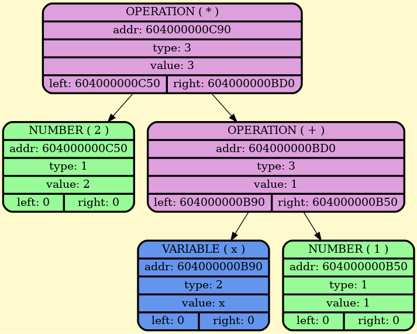

<div align="center">
  
  
  # 🛡️ Implementation of a differentiating calculator in C (C++)
  
  
  
</div>

## 🚀 Quick Start:
To build the project:
```cpp
git clone https://github.com/BulgakovDmitry/differentiator
cd differentiator
make run
./diff.out
```
The project has a function for graphical output of a binary tree. For this purpose graphviz is used. Download it on linux at the following script:
```bash
sudo apt update
sudo apt install graphviz
```
It is also possible to output the expression in a pdf file for easy reading. The built-in tex is used for this purpose. Script for installation:
```bash
sudo apt update
sudo apt install texlive-full
```

## 🔍 Overview:
All mathematical expressions are written in a binary tree.
Structure defenition:
```cpp
struct Node
{
    Types type;
    Value_t value;
    Node* right, *left, *parent;
};
```
Here value may contain a variable, an operation number or an ordinary number
```cpp
union Value_t
{
    double num;
    int op;
    char var;
};
```
In the general case, visually it looks as follows (fragment from the graphical dump)
<div align="center">
  
</div>

## ⚙️ Expression Grammar
The mathematical expression is read from the expression.txt file using the recursive descent algorithm. 
The reading algorithm is implemented by the following grammar:
```bash
GRAMMAR ::= ADD_SUB '$'
ADD_SUB ::= MUL_DIV {['+', '-'] MUL_DIV}*
MUL_DIV ::= POW {['*', '/'] POW}*
POW     ::= FUNC {['^'] FUNC}*
FUNC    ::= ['ln', 'sqrt', 'sin', 'cos', 'tg', 'ctg', 'arctg', 'arcctg', 'arcsin', 'arccos', 
             'neg', 'sh', 'ch', 'th', 'cth'] '(' ADD_SUB ')' | EXPR
EXPR    ::= '(' ADD_SUB ')' | ARG
ARG     ::= NUM | VAR
VAR     ::= ['a'-'z''A'-'Z']*
NUM     ::= ['0'-'9']+
```

## ✨ Example:
| Input            | Simplified Derivative     |
| ---------------- | ------------------------- |
| `sin(x)^2 + x^3$` | `2·sin(x)·cos(x) + 3·x^2` |

## 📂 Project Structure:
```
├── src/                 # *.cpp implementation files
├── headers/             # *.hpp public headers
├── dumpGraph/           # generated Graphviz & HTML reports
├── dumpTex/             # generated LaTeX
├── myLib/               # Helper library
```

## 🔑 Key modules:
| File                   | Responsibility                                          |
| ---------------------- | ------------------------------------------------------- |
| `tree.hpp`, `tree.cpp` | Node structure, memory management                       |
| `DSL.hpp`              | Tiny “language” for expressive AST construction         |
| `read.cpp`             | Recursive-descent parser implementing the grammar above |
| `simplify.cpp`         | Multi-pass simplifier and constant folder               |
| `diff.cpp`             | Symbolic differentiation rules                          |
| `graphDump.cpp`        | Graphviz/HTML visualisation                             |
| `texDump.cpp`          | LaTeX exporter                                          |
| `main.cpp`             | Glue code: orchestrates parse → simplify → diff → dump  |

## 💡 Usage example:
```cpp
#include <stdio.h>
#include <myLib.hpp>
#include "../headers/tree.hpp"
#include "../headers/DSL.hpp"
#include "../headers/simplify.hpp"
#include "../headers/read.hpp"
#include "../headers/diff.hpp"
#include "../headers/graphDump.hpp"
#include "../headers/consoleDump.hpp"
#include "../headers/texDump.hpp"

extern const char* const HTML_FILE_NAME;
extern const char* const TEX_FILE_NAME;
extern const char* const EXPRESSION_FILE;

int main()
{
    FILE* htmlFile = fopen(HTML_FILE_NAME, "w");
    ASSERT(htmlFile, "htmlFile = nullptr", stderr);

    FILE* texFile = fopen(TEX_FILE_NAME, "w=");
    ASSERT(texFile, "texFile = nullptr", stderr);

    FILE* expressionFile = fopen(EXPRESSION_FILE, "rb");
    ASSERT(expressionFile, "expressionFile = nullptr, impossible to read the math expression", stderr);

    Node* root = readExpression(expressionFile);
    ASSERT(root, "root = nullptr, could not be read", stderr);

    size_t countRoot = 0;
    Node* rootSimpl = simplify(copy(root), &countRoot);
    
    Node* deriv = diff(rootSimpl);
    
    size_t countDeriv = 0;
    Node* derivSimpl = simplify(copy(deriv), &countDeriv);
    
    dumpGraph(root, deriv, rootSimpl, derivSimpl, htmlFile);
    dumpTex(root, deriv, rootSimpl, derivSimpl, countRoot, countDeriv, texFile);
    
    dumpConsole(root, "root");
    dumpConsole(derivSimpl, "derivSimpl");
    
    dtorTree(root);
    dtorTree(rootSimpl);
    dtorTree(deriv);
    dtorTree(derivSimpl);

    FCLOSE(htmlFile);
    FCLOSE(texFile);    
    FCLOSE(expressionFile);

    return 0;
}
```

<div align="center">
  
</div>

